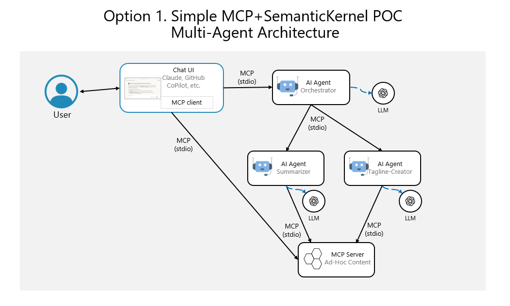

# Multi-Agent Baseline Solution

## Summary

This project aims to create a comprehensive baseline solution for agentic and multi-agent systems using the Model Context Protocol (MCP) and Semantic Kernel. The solution provides three progressive architecture options, from simple local deployment, going through dockerized services and up to cloud-native Kubernetes implementations, demonstrating the evolution of multi-agent system architectures while maintaining core functionality across all variants.

## Product Overview

### Core value proposition:
Provide developers and organizations with a ready-to-use, modular, and extensible foundation for building multi-agent systems that can be deployed across different environments and scaled according to business needs. The solution demonstrates best practices in agent orchestration, MCP integration, and progressive architecture complexity.

### Target audience:
- **Software developers** looking to implement multi-agent systems
- **DevOps engineers** seeking containerized and cloud-native deployment patterns
- **Architects** evaluating multi-agent system design options
- **Organizations** planning to adopt agent-based automation solutions
- **Educational institutions** teaching modern distributed system patterns

## Value Proposition

### Key differentiators:
- **Progressive Architecture**: Three deployment options from local to cloud-native, allowing teams to start simple and scale complexity as needed
- **MCP Integration**: Native support for Model Context Protocol, enabling standardized agent communication
- **Semantic Kernel Foundation**: Built on Microsoft's Semantic Kernel for robust AI agent capabilities
- **Cross-Platform Support**: C# and Python agent implementations for technology diversity
- **Production-Ready Patterns**: Demonstrates industry best practices for containerization, orchestration, and deployment
- **Educational Value**: Serves as a reference architecture for learning multi-agent system design
- **Extensible Design**: Modular architecture allowing easy addition of new agents and communication protocols

## Initial Requirements

### Functional Requirements
1. **Model Context Protocol (MCP) Server**
   - Custom MCP server providing document/content access to AI agents
   - Support for local text files and remote URL content retrieval
   - Expose content as MCP resources and tools
   - Standard MCP protocol compliance with JSON-RPC 2.0 messaging

2. **AI Agent Workflow**
   - Orchestrator Agent: Coordinates workflow and manages MCP client connections
   - Summarization Agent: Processes documents using Semantic Kernel via MCP tools
   - Analysis Agent: Generates taglines/mottos from summaries via MCP communication
   - Sequential workflow execution with result passing through MCP protocol

3. **Content Sources as MCP Resources**
   - Local text file processing exposed as MCP resources
   - Remote URL content fetching exposed as MCP tools
   - Document content accessible through standardized MCP resource requests

4. **MCP Communication Protocols**
   - stdio transport for local agent deployments (MCP standard)
   - HTTP+SSE transport for distributed agent deployments
   - JSON-RPC 2.0 message format as per MCP specification

### Non-Functional Requirements
1. **Deployment Flexibility**
   - Local machine execution
   - Docker container deployment
   - Kubernetes cluster deployment

2. **Documentation and Examples**
   - Comprehensive setup and usage documentation
   - Working examples for each deployment option
   - Code comments and API documentation

3. **Modularity and Extensibility**
   - Clean separation of concerns
   - Plugin-ready architecture
   - Easy addition of new agents

## Functional Specifications

### MCP Server Capabilities
- **Document Provider Service**: Custom MCP server exposing document content as resources and tools through the Model Context Protocol
- **Content Source Management**: Handles local file access and remote URL content fetching, exposing them as MCP resources
- **Tool Interface**: Provides MCP tools for document processing operations (summarization, analysis)
- **Resource Management**: Exposes document content through MCP resource URIs with proper content negotiation

### Agent Specifications
- **Orchestrator Agent** (C#): Acts as MCP client, coordinates workflow execution, manages connections to MCP servers
- **Summarization Agent** (C#): Uses Semantic Kernel to generate summaries, can be integrated within orchestrator or as separate MCP server
- **Analysis Agent** (C#/Python): Analyzes summaries to create taglines/mottos, can be implemented as separate MCP server or integrated component

### User Stories (Baseline)
1. **As a developer**, I want to deploy the MCP server locally so I can test agent workflows quickly
2. **As a user**, I want to submit a local text file so I can get automated summarization and tagline generation
3. **As a user**, I want to provide a URL so the system can process remote content automatically
4. **As a DevOps engineer**, I want to deploy using Docker so I can ensure consistent environments
5. **As a system administrator**, I want to deploy to Kubernetes so I can handle production workloads with scaling capabilities

## Architecture Options Summary

### Architecture Option 1: Local and using stdio MCP and inprocess agents
**Philosophy**: Simplicity and rapid development
- All components run on single machine
- stdio-based MCP transport (JSON-RPC 2.0 over stdin/stdout)
- MCP server providing document access as resources and tools
- Semantic Kernel agents as MCP clients or integrated within orchestrator
- File-based configuration
- Ideal for development, testing, and proof-of-concept scenarios

### Architecture Option 2: Dockerized and using HTTP+SSE MCP and remote agents
**Philosophy**: Containerized modularity with service isolation
- Docker containers for each component
- HTTP+SSE transport for MCP communication (HTTP requests + Server-Sent Events)
- MCP servers as containerized services exposing tools and resources
- Remote agent execution in separate containers acting as MCP clients
- Docker Compose orchestration
- Suitable for medium-scale deployments and staging environments

### Architecture Option 3: Cloud-Native and using Kubernetes, HTTP+SSE MCP and remote agents
**Philosophy**: Enterprise-grade scalability and resilience
- Kubernetes pod deployment
- HTTP+SSE MCP transport with service discovery
- MCP servers as Kubernetes services with tools and resources
- Agents as scalable pods acting as MCP clients
- ConfigMaps and Secrets management
- Production-ready with monitoring and logging integration

## Technical Specifications per Option

### Option 1: Local Implementation
**Technologies:**
- **.NET 8+** for MCP server and C# agents
- **Python 3.11+** for optional Python agent
- **Semantic Kernel .NET** for AI capabilities
- **stdio transport** for MCP communication (JSON-RPC 2.0)
- **Local file system** for document storage

**Components:**
- MCP Server (C# console application exposing resources and tools)
- MCP Client/Orchestrator (C# application managing workflow)
- Summarization Agent (C# with Semantic Kernel, integrated or as MCP server)
- Analysis Agent (C# with Semantic Kernel, integrated or as MCP server)

**Architecture Diagram:**



**Communication Flow:**
```
Local File/URL → MCP Server ←→ MCP Client/Orchestrator ←→ [Summarization → Analysis]
                 (resources)    (stdio JSON-RPC)         (tools/resources)
```

### Option 2: Dockerized Implementation
**Technologies:**
- **.NET 8+ Docker images** for C# components
- **Python 3.11+ Docker images** for Python agents
- **Docker Compose** for orchestration
- **HTTP+SSE transport** for MCP communication
- **Shared volumes** for data exchange

**Components:**
- MCP Server Container (HTTP+SSE, exposing tools and resources)
- MCP Client/Orchestrator Container (coordinates workflow)
- Summarization Agent Container (MCP server or client)
- Analysis Agent Container (MCP server or client)

**Communication Flow:**
```
External Input → MCP Server ←→ MCP Client Containers (via HTTP+SSE JSON-RPC)
                (HTTP+SSE)     (tools/resources)
```

### Option 3: Cloud-Native Kubernetes Implementation
**Technologies:**
- **Kubernetes 1.25+** for orchestration
- **.NET Docker images** optimized for K8s
- **Kubernetes Services** for MCP server discovery
- **HTTP+SSE transport** for MCP communication
- **ConfigMaps** for configuration management
- **Ingress Controller** for external access
- **Helm charts** for deployment automation

**Components:**
- MCP Server Deployment and Service (tools and resources via HTTP+SSE)
- MCP Client/Orchestrator Deployments
- Agent Deployments (Summarization, Analysis as MCP servers or clients)
- ConfigMaps for agent and MCP server configuration
- Services for internal MCP communication
- Ingress for external access

**Communication Flow:**
```
External → Ingress → MCP Services ←→ Agent Services (via K8s networking + HTTP+SSE)
                    (tools/resources)  (JSON-RPC 2.0)
```

## Risk Assessment

### Technical Risks

**High Priority:**
- **MCP Protocol Compatibility**: Risk of version mismatches between .NET and Python MCP implementations
  - *Mitigation*: Use well-tested MCP libraries and maintain version compatibility matrix
- **Semantic Kernel API Changes**: Rapid evolution of Semantic Kernel may break existing implementations
  - *Mitigation*: Pin to stable versions and maintain upgrade path documentation

**Medium Priority:**
- **MCP Transport Reliability**: stdio and HTTP+SSE transport failures in different deployment scenarios
  - *Mitigation*: Implement basic retry mechanisms and timeout handling for MCP connections
- **Container Resource Management**: Improper resource allocation in containerized environments
  - *Mitigation*: Implement proper resource limits and monitoring
- **Configuration Complexity**: Managing MCP server configurations across three different deployment models
  - *Mitigation*: Use configuration templates and validation tools

**Low Priority:**
- **Documentation Maintenance**: Keeping documentation in sync across three architectures
  - *Mitigation*: Automated documentation generation where possible
- **Platform Compatibility**: Ensuring consistent behavior across Windows, Linux, and macOS
  - *Mitigation*: Use containerization and cross-platform testing

## Next Steps

### Discovery Phase
1. **Technology Stack Validation** (Week 1-2)
   - Verify latest MCP protocol implementations for .NET and Python
   - Test Semantic Kernel integration capabilities
   - Validate container base images and Kubernetes compatibility

2. **Architecture Proof of Concept** (Week 3-4)
   - Implement minimal Option 1 (local) version
   - Validate MCP server and agent communication
   - Test basic document processing workflow

3. **Development Planning** (Week 5)
   - Define detailed development sprints
   - Establish coding standards and project structure
   - Set up development environment and CI/CD pipeline

### Deliverables for Next Phase
1. **Working Option 1 Implementation**
   - Functional MCP server with local file and URL support
   - Two working agents (summarization and analysis)
   - Basic workflow orchestration
   - Unit tests and integration tests

2. **Technical Documentation**
   - API specifications for MCP server
   - Agent interface definitions
   - Deployment and setup guides
   - Architecture decision records (ADRs)

3. **Development Infrastructure**
   - Project structure and coding standards
   - CI/CD pipeline for automated testing
   - Development environment setup scripts

4. **Option 2 & 3 Design Documents**
   - Detailed containerization strategy
   - Kubernetes deployment specifications
   - Migration path from Option 1 to Options 2 and 3

## Contact Information
**Project Owner**: CESARDELATORRE  
**Repository**: https://github.com/CESARDELATORRE/agentic-mcp-baseline-solution  
**Primary Technology Stack**: .NET 8+, Semantic Kernel, MCP Protocol, Docker, Kubernetes

## Document Control
**Version**: 1.0  
**Created**: August 6, 2025  
**Last Updated**: August 6, 2025  
**Status**: Initial Draft  
**Next Review**: Upon completion of Discovery Phase
